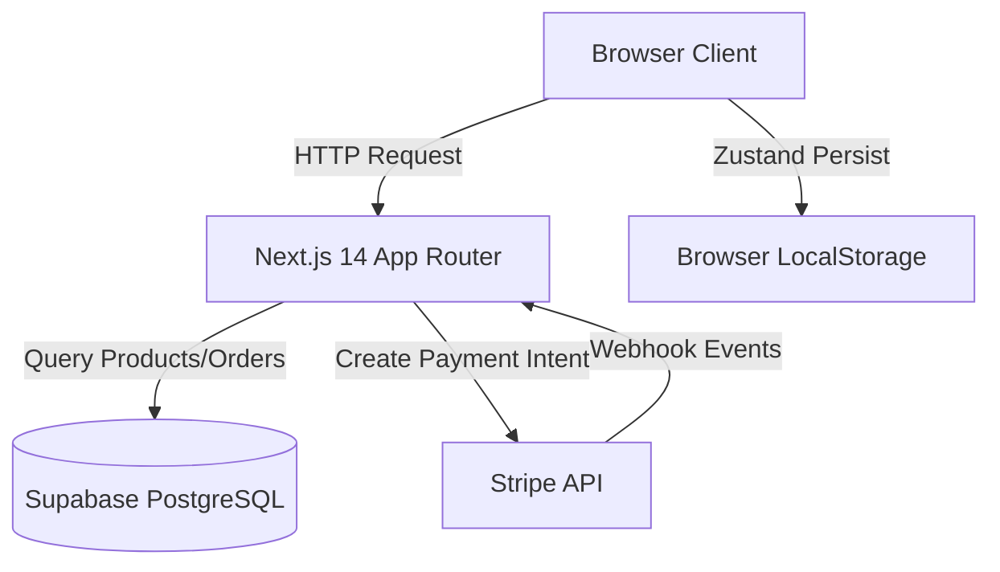

# Design Document

## Overview

The Modern Electrical Storefront is a full-featured e-commerce application built with Next.js 14, targeting Gen Z and young millennial buyers of electrical hardware and home theatre equipment. The application distinguishes itself through a "circuit board chic" design language that grounds every visual element in electrical engineering concepts—circuit traces, LED indicators, datasheet typography, and technical specifications.

The architecture follows Next.js App Router conventions with clear separation between server and client components, Zustand for client-side state management, Supabase for data persistence, and Stripe for payment processing.

### Key Technical Objectives

1. **Mobile-first responsive design** with GPU-accelerated animations
2. **Accessibility compliance** including keyboard navigation and `prefers-reduced-motion` support
3. **Performance optimization** targeting sub-1.5s first meaningful paint
4. **Type-safe data flow** with TypeScript strict mode throughout
5. **Technical aesthetic consistency** using domain-specific design tokens and monospace typography for all technical data

---

## Architecture

### System Architecture

The application follows a modern **JAMstack architecture** with server-side rendering:



### Layer Responsibilities

**Presentation Layer (Client Components)**
- React 18 components with Framer Motion animations
- Zustand stores for cart and comparison state
- Toast notifications via react-hot-toast
- Tailwind CSS utility classes for styling

**Data Layer (Server Components)**
- Next.js server components fetch data from Supabase
- API routes handle mutations and Stripe integration
- Row Level Security (RLS) enforced at database level

**State Management**
- **Cart state**: Zustand with localStorage persistence
- **Compare state**: Zustand with localStorage persistence  
- **Server state**: Fetched fresh on navigation (no client cache)

### Route Architecture

```
app/
├── (shop)/                    # Public storefront route group
│   ├── page.tsx              # Homepage with bento grid
│   ├── shop/page.tsx         # Product catalog with filters
│   ├── product/[slug]/page.tsx  # Product detail
│   ├── cart/page.tsx         # Shopping cart
│   ├── checkout/page.tsx     # Checkout flow
│   └── build-setup/page.tsx  # Kit builder
├── admin/                     # Protected admin route group
│   ├── page.tsx              # Dashboard
│   ├── products/page.tsx     # Product CRUD
│   └── orders/page.tsx       # Order management
└── api/
    ├── create-payment-intent/route.ts
    └── seed/route.ts
```

---

## Components and Interfaces

### Core Component Hierarchy

**Page Components (Server Components)**
- Fetch data from Supabase
- Pass data as props to client components
- Handle initial page rendering

**Client Interactive Components**
- BentoGrid with 3D tilt cards
- TechnicalProductCard with connection-pulse animation
- CartDrawer with slide-in transition
- CompareDrawer for product comparison
- AdminProductForm for product CRUD

### Component Interfaces

#### BentoGrid Component

```typescript
interface BentoTile {
  category: {
    name: string;
    slug: string;
    icon: string;
    description: string;
    specs: string;
  };
  gridSize: 'large' | 'medium' | 'small';  // Auto-mapped to col/row span
  subcategories?: string[];
}

interface BentoGridProps {
  tiles: BentoTile[];
  prefersReducedMotion: boolean;
}
```

**Behavior**:
- On mount: Staggered reveal animation (70ms delay between tiles)
- On hover: 3D tilt effect based on mouse position (±5° rotation)
- On focus: Copper accent focus ring
- Reduced motion: Skip animations, show static tiles

#### TechnicalProductCard Component

```typescript
interface TechnicalProductCardProps {
  product: Product;
  prefersReducedMotion: boolean;
}

interface Product {
  id: string;
  name: string;
  slug: string;
  price: number;
  category: string;
  brand?: string;
  image_url: string;
  stock: number;
  specifications?: Record<string, string>;
}
```

**Behavior**:
- Displays: Product image, name, price, SKU, spec strip, stock LED, Add to Cart button
- On hover: Connection-pulse animation (600ms forward, 300ms reverse)
- Spec strip: Extracts first 3 specs or shows category if no specs
- Stock LED: Color/pulse based on stock level (0=grey, 1-9=red, 10+=cyan)

#### CartStore Interface

```typescript
interface CartStore {
  items: CartItem[];
  isCartOpen: boolean;
  
  // Actions
  addItem: (product: Product, quantity?: number) => void;
  removeItem: (productId: string) => void;
  updateQuantity: (productId: string, quantity: number) => void;
  clearCart: () => void;
  setCartOpen: (open: boolean) => void;
  
  // Computed
  getTotal: () => number;
  getItemCount: () => number;
}
```

**Persistence**: Zustand persist middleware writes to `localStorage['cart-storage']`

#### CompareStore Interface

```typescript
interface CompareStore {
  compareItems: Product[];  // Max 3 items
  
  // Actions
  toggleCompare: (product: Product) => void;
  removeCompare: (productId: string) => void;
  clearCompare: () => void;
}
```

### Animation Component Patterns

**Spring Physics Configuration**
```typescript
const springConfig = {
  stiffness: 400,
  damping: 30,
};

const fadeUpConfig = {
  initial: { opacity: 0, y: 20 },
  animate: { opacity: 1, y: 0 },
  transition: {
    duration: 0.5,
    ease: [0.22, 1, 0.36, 1],  // cubic-bezier
  },
};
```

**Reduced Motion Handling**
```typescript
const motionProps = prefersReducedMotion
  ? { initial: undefined, animate: undefined }
  : { initial: { opacity: 0 }, animate: { opacity: 1 } };
```

### API Route Interfaces

#### Create Payment Intent

```typescript
// POST /api/create-payment-intent
interface PaymentIntentRequest {
  amount: number;  // in cents
  customer_email: string;
}

interface PaymentIntentResponse {
  clientSecret: string;
  paymentIntentId: string;
}
```

#### Seed Database

```typescript
// GET /api/seed
interface SeedResponse {
  message: string;
  productsCreated: number;
}
```

---

## Data Models

### Database Schema (Supabase PostgreSQL)

#### Products Table

```sql
CREATE TABLE products (
  id UUID PRIMARY KEY DEFAULT uuid_generate_v4(),
  name TEXT NOT NULL,
  slug TEXT UNIQUE NOT NULL,
  description TEXT,
  long_description TEXT,
  price DECIMAL(10, 2) NOT NULL,
  category TEXT NOT NULL,
  subcategory TEXT,
  brand TEXT,
  image_url TEXT NOT NULL,
  images TEXT[],
  stock INTEGER DEFAULT 0,
  specifications JSONB,
  created_at TIMESTAMPTZ DEFAULT NOW(),
  updated_at TIMESTAMPTZ DEFAULT NOW()
);

CREATE INDEX idx_products_category ON products(category);
CREATE INDEX idx_products_slug ON products(slug);
CREATE INDEX idx_products_stock ON products(stock);
```

**Row Level Security (RLS)**:
- Public read access (SELECT)
- Authenticated write access (INSERT, UPDATE, DELETE for admins)

#### Orders Table

```sql
CREATE TABLE orders (
  id UUID PRIMARY KEY DEFAULT uuid_generate_v4(),
  user_id UUID REFERENCES auth.users(id),
  customer_name TEXT NOT NULL,
  customer_email TEXT NOT NULL,
  customer_phone TEXT,
  shipping_address JSONB NOT NULL,
  items JSONB NOT NULL,
  subtotal DECIMAL(10, 2) NOT NULL,
  total DECIMAL(10, 2) NOT NULL,
  status TEXT DEFAULT 'pending',
  payment_status TEXT DEFAULT 'pending',
  stripe_payment_intent_id TEXT,
  created_at TIMESTAMPTZ DEFAULT NOW(),
  updated_at TIMESTAMPTZ DEFAULT NOW()
);

CREATE INDEX idx_orders_user ON orders(user_id);
CREATE INDEX idx_orders_status ON orders(status);
CREATE INDEX idx_orders_stripe_intent ON orders(stripe_payment_intent_id);
```

**RLS**:
- Users can read their own orders
- Admins can read all orders

### TypeScript Type Definitions

```typescript
export interface Product {
  id: string;
  name: string;
  slug: string;
  description: string;
  long_description?: string;
  price: number;
  category: string;
  subcategory?: string;
  brand?: string;
  image_url: string;
  images?: string[];
  stock: number;
  specifications?: Record<string, string>;
  created_at: string;
  updated_at: string;
}

export interface CartItem {
  product: Product;
  quantity: number;
}

export interface Order {
  id: string;
  user_id?: string;
  customer_name: string;
  customer_email: string;
  customer_phone: string;
  shipping_address: Address;
  items: OrderItem[];
  subtotal: number;
  total: number;
  status: 'pending' | 'processing' | 'shipped' | 'delivered' | 'cancelled';
  payment_status: 'pending' | 'paid' | 'failed';
  stripe_payment_intent_id?: string;
  created_at: string;
  updated_at: string;
}

export interface OrderItem {
  product_id: string;
  product_name: string;
  quantity: number;
  price: number;
}

export interface Address {
  line1: string;
  line2?: string;
  city: string;
  state: string;
  postal_code: string;
  country: string;
}
```

### Client State Models

**Cart State (localStorage persisted)**
```typescript
{
  state: {
    items: CartItem[];
    isCartOpen: boolean;
  },
  version: 0,
}
```

**Compare State (localStorage persisted)**
```typescript
{
  state: {
    compareItems: Product[];  // Max 3
  },
  version: 0,
}
```

---

## Correctness Properties

### Why No Properties Are Defined

**Property-based testing is not applicable to this feature.** 

PBT requires universal quantification — statements like "for all inputs X, property P(X) holds." This storefront feature consists entirely of:

1. **UI Rendering** — Specific layout requirements (e.g., Req 1.2: "Home Theatre tile SHALL be 7 columns wide") are design decisions, not universal properties
2. **Animations** — Fixed timing parameters (Req 10.2: "stiffness: 400, damping: 30") are exact specifications, not properties that hold across arbitrary inputs
3. **External APIs** — Supabase/Stripe integration uses mocked services for testing; their behavior is tested by the vendors
4. **State Management** — Cart operations (add, remove, calculate total) are best validated with concrete example scenarios

### Validation Approach Instead

Since no universal properties exist, correctness is ensured through:

- **Example-based unit tests** — Specific scenarios like "stock=0 displays grey LED" (Req 5.2), "adding duplicate item increments quantity" (Req 17.1)
- **Snapshot tests** — UI consistency regression detection for bento grid layout (Req 1), product cards (Req 3)
- **Integration tests** — API routes with mocked dependencies and representative payloads
- **Accessibility tests** — WCAG compliance using jest-axe (Req 14)
- **Manual testing** — Responsive breakpoints (Req 13), animation timing (Req 10), cross-browser compatibility

**Key principle:** When you cannot write "for all X, property P(X)" meaningfully, property-based testing is the wrong tool. Example-based tests provide better coverage and clearer intent for UI/animation features.

See the **Testing Strategy** section below for comprehensive test specifications that validate all 17 requirements.

---

## Error Handling

### Error Boundaries

**Global Error Boundary** (`app/error.tsx`)
- Catches React component errors
- Displays technical-themed error message
- Provides "Return to Homepage" action

**Not Found Handler** (`app/not-found.tsx`)
- Displays 404 page with copper accent
- Provides navigation back to shop

### API Error Handling

**Supabase Queries**
```typescript
try {
  const { data, error } = await supabase
    .from('products')
    .select('*');
  
  if (error) throw error;
  return data;
} catch (err) {
  console.error('Database error:', err);
  // Return empty array or cached data as fallback
  return [];
}
```

**Stripe Payment Intent Creation**
```typescript
try {
  const paymentIntent = await stripe.paymentIntents.create({
    amount,
    currency: 'usd',
    metadata: { customer_email },
  });
  
  return { clientSecret: paymentIntent.client_secret };
} catch (err) {
  console.error('Stripe error:', err);
  return NextResponse.json(
    { error: 'Payment initialization failed' },
    { status: 500 }
  );
}
```

### Form Validation

**Checkout Form**
- Required fields: name, email, phone, address
- Email format validation (regex)
- Phone format validation (regex)
- Real-time field-level validation
- Display errors with live-red color

**Admin Product Form**
- Required fields: name, price, category, image_url
- Price validation (positive number)
- Slug auto-generation from name (kebab-case)
- Stock validation (non-negative integer)

### Toast Notifications

Use react-hot-toast for user feedback:

```typescript
import toast from 'react-hot-toast';

// Success (on add to cart)
toast.success('ADDED TO CART', {
  style: {
    background: '#0B0F0E',  // enclosure
    color: '#F2F0E9',        // cable-white
    fontFamily: 'JetBrains Mono',
  },
});

// Error (max comparison reached)
toast.error('Maximum 3 items can be compared.', {
  style: {
    background: '#E8483A',  // live-red
    color: '#F2F0E9',
  },
});
```

### Graceful Degradation

**Image Loading**
- Use Next.js Image with blur placeholder
- Fallback to solid aluminum background on error
- Alt text required for all images

**Animation Failures**
- Reduced motion preference disables animations
- If Framer Motion fails to load, render static final states
- No blocking animations on critical paths

---

## Testing Strategy

### Unit Testing Approach

This feature is primarily focused on UI rendering, layout, animations, and integration with external services (Supabase, Stripe). These areas are **not suitable for property-based testing**. The testing strategy will use:

1. **Component Unit Tests** — Testing individual components with concrete examples
2. **Integration Tests** — Testing API routes with mocked external services
3. **Snapshot Tests** — For UI consistency across changes
4. **Manual Testing** — For accessibility, animations, and responsive design

### Test Categories

#### Component Tests (Jest + React Testing Library)

Test specific examples and edge cases:

```typescript
describe('TechnicalProductCard', () => {
  it('displays spec strip with first 3 specifications', () => {
    const product = {
      specifications: {
        'Amperage': '16A',
        'Voltage': '220V',
        'Poles': '3-pin',
        'Finish': 'Steel',
      },
    };
    // Assert first 3 specs are rendered
  });

  it('shows category when no specifications exist', () => {
    const product = { specifications: {}, category: 'Cables' };
    // Assert category is displayed in spec strip
  });

  it('displays grey LED when stock is 0', () => {
    const product = { stock: 0 };
    // Assert LED color is aluminum grey, label is "OUT"
  });

  it('displays red pulsing LED when stock is 1-9', () => {
    const product = { stock: 5 };
    // Assert LED color is live-red, label is "LOW", pulse animation exists
  });

  it('displays cyan pulsing LED when stock is 10+', () => {
    const product = { stock: 50 };
    // Assert LED color is signal, label is "STOCKED"
  });

  it('disables add to cart button when stock is 0', () => {
    const product = { stock: 0 };
    // Assert button is disabled and shows "UNAVAILABLE"
  });
});
```

#### Cart Store Tests (Jest)

Test cart operations with example data:

```typescript
describe('useCartStore', () => {
  beforeEach(() => {
    useCartStore.getState().clearCart();
  });

  it('adds new item to empty cart', () => {
    const product = mockProduct({ id: '1', price: 100 });
    useCartStore.getState().addItem(product, 2);
    
    const items = useCartStore.getState().items;
    expect(items).toHaveLength(1);
    expect(items[0].quantity).toBe(2);
  });

  it('increments quantity when adding existing item', () => {
    const product = mockProduct({ id: '1', price: 100 });
    useCartStore.getState().addItem(product, 1);
    useCartStore.getState().addItem(product, 1);
    
    const items = useCartStore.getState().items;
    expect(items).toHaveLength(1);
    expect(items[0].quantity).toBe(2);
  });

  it('calculates total correctly', () => {
    const p1 = mockProduct({ id: '1', price: 100 });
    const p2 = mockProduct({ id: '2', price: 50 });
    useCartStore.getState().addItem(p1, 2);  // 200
    useCartStore.getState().addItem(p2, 3);  // 150
    
    expect(useCartStore.getState().getTotal()).toBe(350);
  });

  it('removes item completely when quantity set to 0', () => {
    const product = mockProduct({ id: '1', price: 100 });
    useCartStore.getState().addItem(product, 1);
    useCartStore.getState().updateQuantity('1', 0);
    
    expect(useCartStore.getState().items).toHaveLength(0);
  });
});
```

#### API Route Tests (Jest + Supertest)

Test API endpoints with mocked dependencies:

```typescript
describe('POST /api/create-payment-intent', () => {
  it('creates payment intent with valid amount', async () => {
    const response = await request(app)
      .post('/api/create-payment-intent')
      .send({ amount: 10000, customer_email: 'test@example.com' });
    
    expect(response.status).toBe(200);
    expect(response.body).toHaveProperty('clientSecret');
    expect(response.body).toHaveProperty('paymentIntentId');
  });

  it('returns 400 for missing amount', async () => {
    const response = await request(app)
      .post('/api/create-payment-intent')
      .send({ customer_email: 'test@example.com' });
    
    expect(response.status).toBe(400);
  });

  it('returns 500 when Stripe API fails', async () => {
    // Mock Stripe to throw error
    const response = await request(app)
      .post('/api/create-payment-intent')
      .send({ amount: 10000, customer_email: 'test@example.com' });
    
    expect(response.status).toBe(500);
    expect(response.body).toHaveProperty('error');
  });
});
```

#### Integration Tests

Test database operations with Supabase test instance:

```typescript
describe('getProducts integration', () => {
  it('filters products by category', async () => {
    const products = await getProducts({ category: 'cables-wires' });
    expect(products.every(p => p.category === 'cables-wires')).toBe(true);
  });

  it('filters products by price range', async () => {
    const products = await getProducts({ minPrice: 50, maxPrice: 100 });
    expect(products.every(p => p.price >= 50 && p.price <= 100)).toBe(true);
  });

  it('filters products by in-stock status', async () => {
    const products = await getProducts({ inStock: true });
    expect(products.every(p => p.stock > 0)).toBe(true);
  });
});
```

#### Accessibility Tests (Jest + jest-axe)

```typescript
import { axe } from 'jest-axe';

describe('TechnicalProductCard accessibility', () => {
  it('has no accessibility violations', async () => {
    const { container } = render(<TechnicalProductCard product={mockProduct()} />);
    const results = await axe(container);
    expect(results).toHaveNoViolations();
  });

  it('has visible focus indicators', () => {
    const { getByRole } = render(<TechnicalProductCard product={mockProduct()} />);
    const button = getByRole('button', { name: /add to cart/i });
    button.focus();
    expect(button).toHaveStyle({ outline: '2px solid #C97A4A' });
  });
});
```

#### Snapshot Tests

Capture component rendering for regression detection:

```typescript
describe('BentoGrid snapshots', () => {
  it('matches snapshot for default layout', () => {
    const { container } = render(<BentoGrid tiles={mockTiles} />);
    expect(container).toMatchSnapshot();
  });

  it('matches snapshot with reduced motion', () => {
    const { container } = render(
      <BentoGrid tiles={mockTiles} prefersReducedMotion={true} />
    );
    expect(container).toMatchSnapshot();
  });
});
```

### Manual Testing Checklist

**Responsive Design**
- [ ] Test on mobile (375px, 428px widths)
- [ ] Test on tablet (768px, 1024px widths)
- [ ] Test on desktop (1280px, 1920px widths)
- [ ] Verify touch targets are 44px minimum on mobile
- [ ] Verify horizontal scroll works on product detail page

**Animations**
- [ ] Bento grid staggered reveal on homepage
- [ ] 3D tilt effect on category tiles
- [ ] Connection-pulse on product card hover
- [ ] Stock LED pulse animation
- [ ] Cart drawer slide-in transition
- [ ] Verify all animations respect `prefers-reduced-motion`

**Accessibility**
- [ ] Keyboard navigation through all interactive elements
- [ ] Visible focus rings (copper accent)
- [ ] Screen reader announces cart additions
- [ ] Alt text on all images
- [ ] Proper heading hierarchy
- [ ] Color contrast ratios meet WCAG AA
- [ ] Test with screen reader (NVDA/JAWS/VoiceOver)

**Performance**
- [ ] Lighthouse score >90 on all categories
- [ ] First Contentful Paint <1.5s
- [ ] No layout shift during load
- [ ] Images use next/image with lazy loading
- [ ] Fonts preloaded with display: swap

**Cross-browser**
- [ ] Chrome/Edge (Chromium)
- [ ] Firefox
- [ ] Safari (macOS/iOS)

### Test Environment Setup

```bash
# Install testing dependencies
npm install --save-dev jest @testing-library/react @testing-library/jest-dom jest-axe

# Run tests
npm test                    # All tests
npm test -- --watch        # Watch mode
npm test -- --coverage     # Coverage report
```

**Why Property-Based Testing is NOT Used Here:**

1. **UI Rendering** — Components render specific layouts based on design requirements. These are not universal properties but specific design decisions (e.g., "Home Theatre tile is 7 columns wide"). Snapshot tests and example-based tests are more appropriate.

2. **Animations** — Animation behavior is deterministic based on specific timing functions and easing curves. Testing "for any spring stiffness value" is not meaningful; we need specific stiffness=400, damping=30.

3. **External Services** — Supabase and Stripe are third-party services. We test our integration code with mocks and example payloads, not by generating random inputs.

4. **State Management** — Cart operations have specific business logic (increment quantity, calculate total). Example-based tests with concrete scenarios provide better coverage than random cart operations.

The testing strategy focuses on **concrete examples**, **edge cases**, **integration verification**, and **accessibility compliance** — all areas where example-based testing provides clearer intent and better maintainability than property-based approaches.

