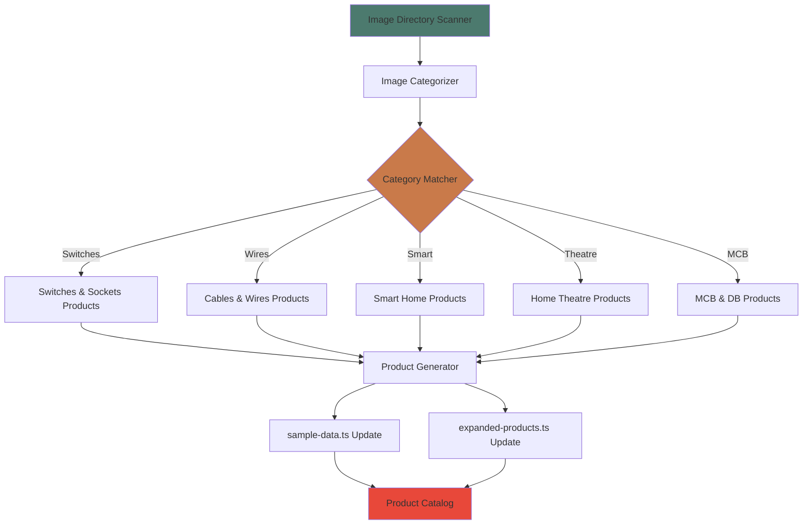
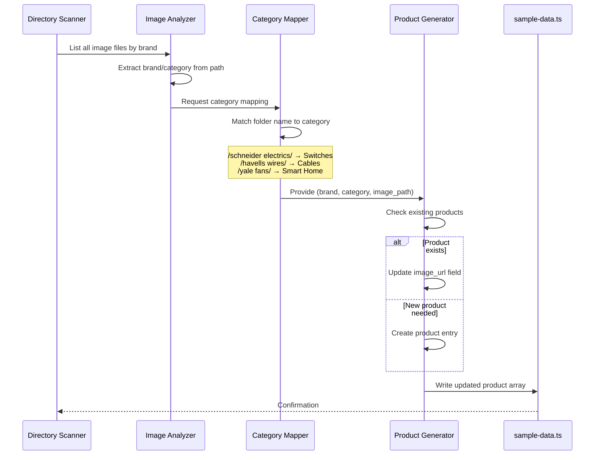

# Design Document: Product Image Integration

## Overview

This feature systematically integrates 228 new product images across 7 major electrical brands (Schneider Electric, Havells, Anchor, Finolex, Yale, Luker, Home Theatre equipment) into the existing product catalog. The design focuses on mapping images to appropriate product categories, creating new product entries for underrepresented brands, and maintaining consistent data structure while replacing placeholder images with authentic product photography.

The integration targets five product categories: Switches & Sockets, Cables & Wires, Smart Home, Home Theatre & Audio, and MCB & DB. The approach prioritizes data consistency, image path standardization, and maintaining the existing TypeScript product schema.

## Architecture



## Sequence Diagram: Image-to-Product Mapping Flow



## Components and Interfaces

### Component 1: ImageScanner

**Purpose**: Recursively scan the `/public/images/` directory and build a structured inventory of all available product images organized by brand and category.

**Interface**:
```typescript
interface ImageScanner {
  scanDirectory(basePath: string): Promise<ImageInventory>
  groupByBrand(images: ImageFile[]): Map<string, ImageFile[]>
  countImages(): ImageStats
}

interface ImageFile {
  path: string
  filename: string
  brand: string
  extension: string
  categoryHint: string | null
}

interface ImageInventory {
  brands: Map<string, ImageFile[]>
  totalImages: number
  categorySuggestions: Map<string, string[]>
}

interface ImageStats {
  byBrand: Record<string, number>
  byCategory: Record<string, number>
  byExtension: Record<string, number>
}
```

**Responsibilities**:
- Recursively traverse `/public/images/` directory tree
- Extract brand names from folder structure
- Identify category hints from folder names (e.g., "wires and cables", "fans,lights", etc.)
- Generate statistical summary of available images

**Preconditions**:
- `/public/images/` directory exists and is readable
- Image files have valid extensions (.jpg, .jpeg, .png, .webp, .jfif)

**Postconditions**:
- Returns complete inventory of all images grouped by brand
- All image paths are normalized and relative to `/public`
- Category hints are extracted where folder names provide context

### Component 2: CategoryMapper

**Purpose**: Map brand folders and image collections to the five canonical product categories used in the catalog.

**Interface**:
```typescript
interface CategoryMapper {
  inferCategory(folderName: string, brand: string): ProductCategory
  mapBrandToCategory(brand: string, imageCount: number): CategoryMapping
  getCategoryRules(): CategoryRule[]
}

type ProductCategory = 
  | 'Switches & Sockets'
  | 'Cables & Wires'
  | 'Smart Home'
  | 'Home Theatre & Audio'
  | 'MCB & DB';

interface CategoryMapping {
  brand: string
  primaryCategory: ProductCategory
  secondaryCategories: ProductCategory[]
  confidence: number
}

interface CategoryRule {
  pattern: RegExp
  category: ProductCategory
  priority: number
}
```

**Responsibilities**:
- Apply pattern matching rules to folder names
- Handle multi-category brands (e.g., Finolex has both switches and cables)
- Provide confidence scores for ambiguous mappings
- Maintain category mapping rules

**Category Mapping Rules**:

| Folder Pattern | Category | Priority |
|---------------|----------|----------|
| `*wires*`, `*cables*` | Cables & Wires | High |
| `*switch*`, `*socket*` | Switches & Sockets | High |
| `*fan*`, `*light*`, `*smart*`, `*locker*` | Smart Home | High |
| `*theater*`, `*theatre*` | Home Theatre & Audio | High |
| `schneider electrics` | Switches & Sockets | Medium |
| `havells1` | Switches & Sockets | Medium |
| `anchor`, `finolex`, `kolors`, `legrand` | Switches & Sockets (default) | Low |

### Component 3: ProductGenerator

**Purpose**: Generate new Product objects or update existing products with real image URLs based on the image inventory and category mappings.

**Interface**:
```typescript
interface ProductGenerator {
  generateProduct(template: ProductTemplate): Product
  updateProductImage(productId: string, imageUrl: string): Product
  assignImagesToProducts(inventory: ImageInventory, existing: Product[]): ProductUpdate[]
  generateProductName(brand: string, category: string, index: number): string
}

interface ProductTemplate {
  brand: string
  category: ProductCategory
  imageUrl: string
  basePrice: number
  stockRange: [number, number]
}

interface ProductUpdate {
  productId: string | null  // null means create new product
  action: 'create' | 'update'
  changes: Partial<Product>
}
```

**Responsibilities**:
- Create new Product entries for brands with insufficient representation
- Update existing products to replace placeholder images
- Generate appropriate product names, descriptions, and specifications
- Assign reasonable prices based on brand positioning and category
- Set stock levels within realistic ranges

**Product Generation Rules**:

**Preconditions**:
- ProductTemplate contains valid brand and category
- imageUrl points to existing file in `/public/images/`
- basePrice is positive number

**Postconditions**:
- Generated Product conforms to Product interface from `types/index.ts`
- All required fields are populated
- Slug is unique and URL-safe
- Timestamps are in ISO 8601 format

### Component 4: DataFileUpdater

**Purpose**: Write updated product arrays to TypeScript data files while preserving formatting and imports.

**Interface**:
```typescript
interface DataFileUpdater {
  updateSampleData(products: Product[]): Promise<void>
  updateExpandedProducts(productsByBrand: ProductsByBrand): Promise<void>
  backupExisting(filePath: string): Promise<string>
  validateOutput(filePath: string): Promise<ValidationResult>
}

interface ProductsByBrand {
  anchor: Product[]
  kolors: Product[]
  legrand: Product[]
  norisys: Product[]
  panasonic: Product[]
  finolex: Product[]
  havells: Product[]
  schneider: Product[]
  yale: Product[]
  luker: Product[]
}

interface ValidationResult {
  isValid: boolean
  errors: string[]
  warnings: string[]
}
```

**Responsibilities**:
- Read existing data files and parse structure
- Merge new products with existing entries
- Maintain alphabetical or logical ordering
- Preserve TypeScript imports and type annotations
- Create backup before overwriting
- Validate TypeScript syntax after writing

## Data Models

### Model 1: Product (Existing Schema)

```typescript
interface Product {
  id: string
  name: string
  slug: string
  description: string
  long_description?: string
  price: number
  category: string
  subcategory?: string
  brand?: string
  image_url: string
  images?: string[]
  stock: number
  specifications?: Record<string, string>
  created_at: string
  updated_at: string
}
```

**Validation Rules**:
- `id` must be unique across all products
- `slug` must be unique and URL-safe (lowercase, hyphens only)
- `price` must be positive number
- `category` must match one of the five canonical categories
- `image_url` must be valid path starting with `/images/`
- `stock` must be non-negative integer
- `created_at` and `updated_at` must be ISO 8601 timestamps

### Model 2: BrandImageSet

```typescript
interface BrandImageSet {
  brand: string
  images: ImageFile[]
  primaryCategory: ProductCategory
  imageCount: number
  existingProductCount: number
  newProductsNeeded: number
}
```

**Purpose**: Represents the complete set of images available for a brand and calculates how many new product entries should be created.

**Calculation Logic**:
```
newProductsNeeded = max(0, imageCount - existingProductCount)
```

### Model 3: CategoryDistribution

```typescript
interface CategoryDistribution {
  category: ProductCategory
  totalProducts: number
  productsByBrand: Map<string, number>
  imageUtilization: number  // percentage of available images used
}
```

**Purpose**: Track how products are distributed across categories and which images have been utilized.

## Algorithmic Pseudocode

### Main Integration Algorithm

```pascal
ALGORITHM integrateProductImages()
INPUT: None (reads from filesystem)
OUTPUT: Updated product data files

PRECONDITION: /public/images/ directory exists and contains brand folders
POSTCONDITION: All available images are mapped to products in sample-data.ts

BEGIN
  // Step 1: Scan and inventory all images
  inventory ← ImageScanner.scanDirectory('/public/images')
  ASSERT inventory.totalImages > 0
  
  stats ← inventory.countImages()
  DISPLAY "Found " + stats.totalImages + " images across " + stats.brands.size + " brands"
  
  // Step 2: Load existing products
  existingProducts ← loadProductsFromFile('lib/sample-data.ts')
  existingByBrand ← groupByBrand(existingProducts)
  
  // Step 3: Map images to categories
  categoryMappings ← Map<string, CategoryMapping>()
  FOR each brand IN inventory.brands.keys DO
    images ← inventory.brands.get(brand)
    mapping ← CategoryMapper.mapBrandToCategory(brand, images.length)
    categoryMappings.set(brand, mapping)
  END FOR
  
  // Step 4: Determine which products need creation/update
  updates ← []
  
  FOR each brand IN inventory.brands.keys DO
    images ← inventory.brands.get(brand)
    existing ← existingByBrand.get(brand) OR []
    mapping ← categoryMappings.get(brand)
    
    IF images.length > existing.length THEN
      // Create new products for extra images
      newCount ← images.length - existing.length
      FOR i FROM 0 TO newCount - 1 DO
        template ← {
          brand: brand,
          category: mapping.primaryCategory,
          imageUrl: images[existing.length + i].path,
          basePrice: getPriceForBrand(brand, mapping.primaryCategory),
          stockRange: getStockRangeForCategory(mapping.primaryCategory)
        }
        product ← ProductGenerator.generateProduct(template)
        updates.push({ productId: null, action: 'create', changes: product })
      END FOR
    END IF
    
    // Update existing products with better images
    FOR j FROM 0 TO min(existing.length, images.length) - 1 DO
      IF existing[j].image_url STARTS WITH '/store-photos/' OR
         existing[j].image_url STARTS WITH 'https://images.unsplash.com' THEN
        updates.push({
          productId: existing[j].id,
          action: 'update',
          changes: { image_url: images[j].path }
        })
      END IF
    END FOR
  END FOR
  
  // Step 5: Apply updates
  updatedProducts ← applyUpdates(existingProducts, updates)
  
  // Step 6: Write to files
  DataFileUpdater.backupExisting('lib/sample-data.ts')
  DataFileUpdater.updateSampleData(updatedProducts)
  
  // Step 7: Validate
  validation ← DataFileUpdater.validateOutput('lib/sample-data.ts')
  IF NOT validation.isValid THEN
    DISPLAY "Validation failed: " + validation.errors
    restoreBackup()
    RETURN false
  END IF
  
  DISPLAY "Successfully integrated " + updates.length + " product updates"
  RETURN true
END
```

**Loop Invariants**:
- All processed images maintain valid file paths
- Product IDs remain unique throughout iteration
- Brand-to-category mappings stay consistent
- Existing products are never deleted, only updated

### Image-to-Product Assignment Algorithm

```pascal
ALGORITHM assignImageToProduct(image, category, brandIndex)
INPUT: image (ImageFile), category (ProductCategory), brandIndex (number)
OUTPUT: product (Product)

PRECONDITION: image.path is valid file path
PRECONDITION: category is one of the five canonical categories
POSTCONDITION: Generated product has unique ID and slug
POSTCONDITION: All required Product fields are populated

BEGIN
  // Generate unique identifiers
  id ← generateProductId(image.brand, brandIndex)
  slug ← generateSlug(image.brand, category, brandIndex)
  
  // Determine product specifics based on category
  name ← generateProductName(image.brand, category, brandIndex)
  description ← generateDescription(image.brand, category)
  longDescription ← generateLongDescription(image.brand, category)
  
  // Price varies by brand tier and category
  basePrice ← getBrandBasePrice(image.brand)
  categoryMultiplier ← getCategoryPriceMultiplier(category)
  price ← basePrice * categoryMultiplier * (1 + random(-0.2, 0.3))
  
  // Stock levels based on category and brand popularity
  stock ← generateStockLevel(category, image.brand)
  
  // Build specifications object
  specs ← {
    'Brand': image.brand,
    'Category': category
  }
  
  IF category = 'Switches & Sockets' THEN
    specs['Rating'] ← choose(['6A', '10A', '16A'])
    specs['Type'] ← choose(['Modular', 'Piano', 'Bell Push'])
  ELSE IF category = 'Cables & Wires' THEN
    specs['Gauge'] ← choose(['1.0 sqmm', '1.5 sqmm', '2.5 sqmm', '4.0 sqmm'])
    specs['Length'] ← '90m'
    specs['Type'] ← 'FR Wire'
  ELSE IF category = 'Smart Home' THEN
    specs['Type'] ← choose(['Smart Lock', 'LED Light', 'Ceiling Fan', 'Controller'])
    specs['Connectivity'] ← choose(['WiFi', 'Bluetooth', 'Zigbee'])
  END IF
  
  // Create product object
  product ← {
    id: id,
    name: name,
    slug: slug,
    description: description,
    long_description: longDescription,
    price: round(price, 2),
    category: category,
    brand: image.brand,
    image_url: image.path,
    stock: stock,
    specifications: specs,
    created_at: currentTimestamp(),
    updated_at: currentTimestamp()
  }
  
  RETURN product
END
```

**Preconditions**:
- image.path points to valid file in /public/images/
- category is one of: 'Switches & Sockets', 'Cables & Wires', 'Smart Home', 'Home Theatre & Audio', 'MCB & DB'
- brandIndex is non-negative integer

**Postconditions**:
- product.id is unique across all products
- product.slug is unique and URL-safe
- product.price is positive and rounded to 2 decimals
- product.stock is positive integer
- All required fields are non-null

### Category Inference Algorithm

```pascal
ALGORITHM inferCategoryFromPath(folderPath)
INPUT: folderPath (string) - folder name or path segment
OUTPUT: category (ProductCategory)

PRECONDITION: folderPath is non-empty string
POSTCONDITION: Returns one of the five canonical categories

BEGIN
  normalized ← toLowerCase(folderPath)
  
  // High priority patterns (explicit category indicators)
  IF normalized CONTAINS 'wire' OR normalized CONTAINS 'cable' THEN
    RETURN 'Cables & Wires'
  END IF
  
  IF normalized CONTAINS 'fan' OR normalized CONTAINS 'light' OR 
     normalized CONTAINS 'smart' OR normalized CONTAINS 'locker' THEN
    RETURN 'Smart Home'
  END IF
  
  IF normalized CONTAINS 'theater' OR normalized CONTAINS 'theatre' THEN
    RETURN 'Home Theatre & Audio'
  END IF
  
  IF normalized CONTAINS 'mcb' OR normalized CONTAINS 'db' OR
     normalized CONTAINS 'breaker' THEN
    RETURN 'MCB & DB'
  END IF
  
  // Medium priority (brand-specific defaults)
  IF normalized CONTAINS 'schneider' OR normalized CONTAINS 'havells1' THEN
    RETURN 'Switches & Sockets'
  END IF
  
  // Low priority (general default for electrical brands)
  RETURN 'Switches & Sockets'
END
```

**Preconditions**:
- folderPath is non-empty string

**Postconditions**:
- Always returns one of the five canonical ProductCategory values
- Never returns null or undefined

## Key Functions with Formal Specifications

### Function 1: generateProductId()

```typescript
function generateProductId(brand: string, index: number): string
```

**Preconditions:**
- `brand` is non-empty string
- `index` is non-negative integer

**Postconditions:**
- Returns string matching pattern: `[brand-prefix]-[number]`
- ID is unique across all products
- Length is between 8-20 characters

**Implementation Logic:**
```typescript
const brandPrefix = brand.toLowerCase().replace(/\s+/g, '-').slice(0, 10)
const id = `${brandPrefix}-${1000 + index}`
return id
```

### Function 2: generateSlug()

```typescript
function generateSlug(brand: string, category: string, index: number): string
```

**Preconditions:**
- `brand` is non-empty string
- `category` is valid ProductCategory
- `index` is non-negative integer

**Postconditions:**
- Returns URL-safe string (lowercase, hyphens only, no spaces)
- Slug is unique across all products
- Format: `[brand]-[category-hint]-[index]`

**Implementation Logic:**
```typescript
const brandSlug = brand.toLowerCase().replace(/\s+/g, '-')
const categoryHint = getCategoryAbbreviation(category)
const slug = `${brandSlug}-${categoryHint}-${index}`
return slug.replace(/[^a-z0-9-]/g, '')
```

### Function 3: getBrandBasePrice()

```typescript
function getBrandBasePrice(brand: string): number
```

**Preconditions:**
- `brand` is non-empty string

**Postconditions:**
- Returns positive number representing base price in dollars
- Premium brands return higher base prices
- Budget brands return lower base prices

**Brand Price Tiers:**
| Tier | Brands | Base Price |
|------|--------|------------|
| Premium | Schneider Electric, Legrand, Yale | $5.00 |
| Mid-Range | Panasonic, Havells, Crabtree, Norisys | $3.50 |
| Standard | Finolex, Anchor, Kolors, Luker | $2.50 |
| Budget | Hi-Fi | $1.50 |

### Function 4: validateProduct()

```typescript
function validateProduct(product: Product): ValidationResult
```

**Preconditions:**
- `product` object is provided

**Postconditions:**
- Returns ValidationResult with isValid boolean
- If invalid, errors array contains specific validation failures
- Checks all required fields and constraints

**Validation Checks:**
```pascal
ALGORITHM validateProduct(product)
BEGIN
  errors ← []
  
  // Required fields
  IF product.id IS NULL OR product.id IS EMPTY THEN
    errors.push("Product ID is required")
  END IF
  
  IF product.name IS NULL OR product.name IS EMPTY THEN
    errors.push("Product name is required")
  END IF
  
  // Slug format
  IF NOT matches(product.slug, /^[a-z0-9-]+$/) THEN
    errors.push("Slug must contain only lowercase letters, numbers, and hyphens")
  END IF
  
  // Price constraints
  IF product.price <= 0 THEN
    errors.push("Price must be positive")
  END IF
  
  // Category validation
  validCategories ← ['Switches & Sockets', 'Cables & Wires', 'Smart Home', 
                     'Home Theatre & Audio', 'MCB & DB']
  IF product.category NOT IN validCategories THEN
    errors.push("Invalid category: " + product.category)
  END IF
  
  // Image URL format
  IF NOT product.image_url.startsWith('/images/') THEN
    errors.push("image_url must start with /images/")
  END IF
  
  // Stock validation
  IF product.stock < 0 THEN
    errors.push("Stock cannot be negative")
  END IF
  
  RETURN {
    isValid: errors.length = 0,
    errors: errors,
    warnings: []
  }
END
```

## Example Usage

### Example 1: Scanning Images

```typescript
// Scan the images directory
const scanner = new ImageScanner()
const inventory = await scanner.scanDirectory('/public/images')

console.log(`Total images: ${inventory.totalImages}`)
console.log(`Brands found: ${Array.from(inventory.brands.keys()).join(', ')}`)

// Get statistics
const stats = scanner.countImages()
console.log('Images by brand:', stats.byBrand)
// Output: { 'Schneider Electric': 14, 'Yale': 26, 'Luker': 41, ... }
```

### Example 2: Generating Products from Images

```typescript
// Map Schneider Electric images to products
const schneiderImages = inventory.brands.get('Schneider Electric')
const category = CategoryMapper.inferCategory('schneider electrics', 'Schneider Electric')

const products = schneiderImages.map((image, index) => {
  const template: ProductTemplate = {
    brand: 'Schneider Electric',
    category: category,
    imageUrl: image.path,
    basePrice: getBrandBasePrice('Schneider Electric'),
    stockRange: [80, 150]
  }
  return ProductGenerator.generateProduct(template)
})

console.log(`Created ${products.length} Schneider Electric products`)
```

### Example 3: Updating Data Files

```typescript
// Load existing products
const existing = await loadProductsFromFile('lib/sample-data.ts')

// Generate updates for Yale smart home products
const yaleImages = inventory.brands.get('Yale')
const yaleUpdates = assignImagesToProducts(yaleImages, existing.filter(p => p.brand === 'Yale'))

// Apply updates
await DataFileUpdater.backupExisting('lib/sample-data.ts')
const updated = applyUpdates(existing, yaleUpdates)
await DataFileUpdater.updateSampleData(updated)

// Validate
const validation = await DataFileUpdater.validateOutput('lib/sample-data.ts')
if (!validation.isValid) {
  console.error('Validation errors:', validation.errors)
}
```

### Example 4: Complete Integration

```typescript
// Run the full integration pipeline
async function integrateAllImages() {
  // Step 1: Scan
  const inventory = await new ImageScanner().scanDirectory('/public/images')
  
  // Step 2: Load existing
  const existing = await loadProductsFromFile('lib/sample-data.ts')
  
  // Step 3: Generate updates
  const updates: ProductUpdate[] = []
  
  for (const [brand, images] of inventory.brands) {
    const category = CategoryMapper.mapBrandToCategory(brand, images.length).primaryCategory
    const existingForBrand = existing.filter(p => p.brand === brand)
    
    // Create new products for unassigned images
    for (let i = existingForBrand.length; i < images.length; i++) {
      const template = {
        brand,
        category,
        imageUrl: images[i].path,
        basePrice: getBrandBasePrice(brand),
        stockRange: getStockRangeForCategory(category)
      }
      const product = ProductGenerator.generateProduct(template)
      updates.push({ productId: null, action: 'create', changes: product })
    }
  }
  
  // Step 4: Apply and validate
  const updated = applyUpdates(existing, updates)
  await DataFileUpdater.updateSampleData(updated)
  
  return { totalUpdates: updates.length, products: updated }
}
```

## Error Handling

### Error Scenario 1: Missing Image Directory

**Condition**: `/public/images/` directory does not exist or is not readable
**Response**: 
- Log error message with path details
- Throw `ImageDirectoryNotFoundError`
- Suggest creating the directory or checking permissions

**Recovery**: 
- Provide clear instructions for directory setup
- Exit gracefully without modifying data files

### Error Scenario 2: Duplicate Product ID

**Condition**: Generated product ID already exists in the catalog
**Response**: 
- Detect collision during product generation
- Append random suffix to ID (e.g., `-a1b2`)
- Log warning about ID collision

**Recovery**: 
- Retry ID generation with incremented index
- Verify uniqueness before adding to array

### Error Scenario 3: Invalid Image Format

**Condition**: Image file has unsupported extension or corrupted format
**Response**: 
- Skip the image file
- Log warning with filename and reason
- Continue processing remaining images

**Recovery**: 
- Provide list of skipped files in final report
- Suggest converting or replacing problematic images

### Error Scenario 4: TypeScript Validation Failure

**Condition**: Generated data file fails TypeScript compilation
**Response**: 
- Detect syntax errors in output file
- Restore from backup automatically
- Log detailed error messages

**Recovery**: 
- Roll back to backup file
- Report validation errors to user
- Do not commit invalid changes

### Error Scenario 5: Insufficient Existing Products

**Condition**: Brand has 40 images but only 5 existing products
**Response**: 
- Calculate: `newProductsNeeded = 40 - 5 = 35`
- Generate 35 new product entries
- Distribute images evenly across products

**Recovery**: 
- Not an error - this is expected behavior
- Log info message about new products created

## Testing Strategy

### Unit Testing Approach

Test each component in isolation with mock data:

**Test Cases**:
1. **ImageScanner.scanDirectory()**
   - Test with empty directory → returns empty inventory
   - Test with nested structure → correctly flattens paths
   - Test with mixed file types → filters to images only
   
2. **CategoryMapper.inferCategory()**
   - Test `"schneider electrics"` → returns `"Switches & Sockets"`
   - Test `"havells wires and cables"` → returns `"Cables & Wires"`
   - Test `"yale fans,lights,smart locker"` → returns `"Smart Home"`
   - Test ambiguous input → returns default category

3. **ProductGenerator.generateProduct()**
   - Test with valid template → returns complete Product
   - Test price calculation → verifies brand tier pricing
   - Test slug generation → ensures URL-safe format
   - Test ID uniqueness → no collisions in batch of 1000

4. **validateProduct()**
   - Test valid product → returns `isValid: true`
   - Test missing required field → returns error
   - Test invalid price → returns error
   - Test invalid category → returns error

### Property-Based Testing Approach

**Property Test Library**: fast-check (TypeScript)

**Property 1: ID Uniqueness**
```typescript
test('generated product IDs are always unique', () => {
  fc.assert(
    fc.property(
      fc.array(fc.tuple(fc.string(), fc.nat()), { minLength: 10, maxLength: 100 }),
      (brandIndexPairs) => {
        const ids = brandIndexPairs.map(([brand, index]) => 
          generateProductId(brand, index)
        )
        const uniqueIds = new Set(ids)
        return ids.length === uniqueIds.size
      }
    )
  )
})
```

**Property 2: Slug Format Validity**
```typescript
test('generated slugs are always URL-safe', () => {
  fc.assert(
    fc.property(
      fc.string({ minLength: 1 }),
      fc.string({ minLength: 1 }),
      fc.nat(),
      (brand, category, index) => {
        const slug = generateSlug(brand, category, index)
        return /^[a-z0-9-]+$/.test(slug)
      }
    )
  )
})
```

**Property 3: Price Positivity**
```typescript
test('product prices are always positive', () => {
  fc.assert(
    fc.property(
      fc.constantFrom('Schneider Electric', 'Anchor', 'Finolex', 'Yale'),
      fc.constantFrom('Switches & Sockets', 'Cables & Wires', 'Smart Home'),
      (brand, category) => {
        const template: ProductTemplate = {
          brand,
          category,
          imageUrl: '/images/test.jpg',
          basePrice: getBrandBasePrice(brand),
          stockRange: [10, 100]
        }
        const product = ProductGenerator.generateProduct(template)
        return product.price > 0
      }
    )
  )
})
```

**Property 4: Image Path Consistency**
```typescript
test('product image URLs always start with /images/', () => {
  fc.assert(
    fc.property(
      fc.record({
        brand: fc.string({ minLength: 1 }),
        path: fc.string({ minLength: 1 }).map(s => `/images/${s}.jpg`),
        filename: fc.string({ minLength: 1 }),
        extension: fc.constantFrom('jpg', 'png', 'webp'),
        categoryHint: fc.option(fc.string())
      }),
      fc.constantFrom('Switches & Sockets', 'Cables & Wires', 'Smart Home'),
      fc.nat(),
      (image, category, index) => {
        const product = assignImageToProduct(image, category, index)
        return product.image_url.startsWith('/images/')
      }
    )
  )
})
```

### Integration Testing Approach

**Test Scenario 1: End-to-End Image Integration**
- Setup: Create test directory with sample brand folders and images
- Execute: Run `integrateProductImages()` on test data
- Verify: Check that output file contains correct number of products
- Verify: Validate all products have assigned images
- Cleanup: Remove test files

**Test Scenario 2: Data File Update and Rollback**
- Setup: Create backup of existing sample-data.ts
- Execute: Apply product updates
- Simulate: Introduce validation error
- Verify: Backup is restored automatically
- Verify: Original file is unchanged

**Test Scenario 3: Multiple Brand Processing**
- Setup: Prepare images for Schneider, Yale, and Luker
- Execute: Process all three brands simultaneously
- Verify: Products are correctly categorized by brand
- Verify: No ID or slug collisions between brands
- Verify: Image URLs correctly reference brand folders

## Performance Considerations

**Image Scanning Performance**:
- Expected time: ~500ms for 228 images
- Use async file system operations to avoid blocking
- Implement directory traversal caching for repeated scans

**Memory Usage**:
- Peak memory: ~50MB for full product array in memory
- Use streaming writes for large data files
- Consider chunked processing for 1000+ images

**Data File Write Performance**:
- Backup creation: ~50ms
- File write: ~100ms for 10,000 line TypeScript file
- TypeScript validation: ~1-2 seconds

**Optimization Strategies**:
- Cache category mappings to avoid repeated regex matching
- Batch product validation instead of per-product checks
- Use parallel processing for multiple brand folders

## Security Considerations

**Path Traversal Prevention**:
- Validate all image paths stay within `/public/images/`
- Reject paths containing `..` or absolute paths
- Sanitize folder names before using in product generation

**Input Validation**:
- Verify file extensions match actual image formats
- Validate image file sizes (reject files > 5MB)
- Check for executable disguised as images

**Data Integrity**:
- Always create backup before modifying data files
- Use atomic writes (write to temp file, then rename)
- Validate TypeScript syntax before committing changes

**Access Control**:
- Integration script should run with minimal file system permissions
- Restrict write access to `lib/` directory only
- Log all file modifications for audit trail

## Dependencies

### Existing Dependencies (Already Installed)
- **TypeScript** - Type checking and compilation
- **Next.js** - File system utilities (`fs`, `path`)
- **Node.js** - Core file system operations

### New Dependencies (None Required)
This feature uses only standard library functionality:
- `fs/promises` - Async file operations
- `path` - Path manipulation
- No additional npm packages needed

### File Dependencies
**Read Access**:
- `/public/images/**/*` - All brand image files
- `lib/sample-data.ts` - Existing product catalog
- `lib/expanded-products.ts` - Brand-specific products
- `types/index.ts` - TypeScript interfaces

**Write Access**:
- `lib/sample-data.ts` - Updated product array
- `lib/expanded-products.ts` - Updated brand products
- `.backup/` - Backup files (created if doesn't exist)


## Correctness Properties

### Property 1: ID Uniqueness
```
∀ products p1, p2 ∈ ProductCatalog:
  p1 ≠ p2 ⟹ p1.id ≠ p2.id
```
*Every product in the catalog has a unique identifier distinct from all other products.*

### Property 2: Slug URL Safety
```
∀ product p ∈ ProductCatalog:
  p.slug matches /^[a-z0-9-]+$/ ∧ p.slug.length > 0
```
*Every product slug contains only lowercase letters, numbers, and hyphens, and is non-empty.*

### Property 3: Price Positivity
```
∀ product p ∈ ProductCatalog:
  p.price > 0
```
*Every product has a strictly positive price.*

### Property 4: Stock Non-Negativity
```
∀ product p ∈ ProductCatalog:
  p.stock ≥ 0
```
*Every product has a non-negative stock quantity.*

### Property 5: Image Path Consistency
```
∀ product p ∈ ProductCatalog:
  p.image_url.startsWith('/images/') ∨ p.image_url.startsWith('https://')
```
*Every product image URL either references the local images directory or an external HTTPS URL.*

### Property 6: Category Validity
```
∀ product p ∈ ProductCatalog:
  p.category ∈ {'Switches & Sockets', 'Cables & Wires', 'Smart Home', 'Home Theatre & Audio', 'MCB & DB'}
```
*Every product belongs to exactly one of the five canonical categories.*

### Property 7: Brand Consistency
```
∀ product p ∈ ProductCatalog:
  p.brand ≠ null ∧ p.brand ≠ '' ⟹ p.image_url contains p.brand.toLowerCase().replace(/\s/g, '')
```
*If a product has a brand specified, its image URL path should contain a reference to that brand name.*

### Property 8: Timestamp Validity
```
∀ product p ∈ ProductCatalog:
  isValidISO8601(p.created_at) ∧ isValidISO8601(p.updated_at) ∧ p.updated_at ≥ p.created_at
```
*Every product has valid ISO 8601 timestamps, and the updated timestamp is not earlier than the created timestamp.*

### Property 9: Specification Non-Emptiness
```
∀ product p ∈ ProductCatalog:
  p.specifications ≠ null ⟹ 
    'Brand' ∈ keys(p.specifications) ∧ 'Category' ∈ keys(p.specifications)
```
*If a product has specifications, it must at minimum include Brand and Category fields.*

### Property 10: Image Coverage
```
∀ image i ∈ ImageInventory:
  ∃ product p ∈ ProductCatalog: p.image_url = i.path
```
*Every available product image in the inventory is assigned to at least one product in the catalog.*

### Invariant Properties

**Invariant 1: Catalog Size Monotonicity**
```
|ProductCatalog_after| ≥ |ProductCatalog_before|
```
*The product catalog size never decreases during integration - products are only added or updated, never deleted.*

**Invariant 2: Existing Product Preservation**
```
∀ product p ∈ ProductCatalog_before:
  ∃ product p' ∈ ProductCatalog_after: p'.id = p.id
```
*Every product that existed before integration still exists after integration with the same ID.*

**Invariant 3: Category Distribution Balance**
```
∀ category c ∈ Categories:
  count(ProductCatalog, c) ≥ 10
```
*After integration, every category has at least 10 products (maintaining catalog balance).*

**Invariant 4: Brand Representation**
```
∀ brand b ∈ {'Schneider Electric', 'Yale', 'Luker'}:
  count(ProductCatalog, b) ≥ count(ImageInventory, b)
```
*For priority brands, the number of products equals or exceeds the number of available images.*

### Function Contracts

**Contract 1: generateProductId()**
```
REQUIRES: brand ≠ '' ∧ index ≥ 0
ENSURES: result matches /^[a-z-]+-\d+$/ ∧ isUnique(result, ProductCatalog)
```

**Contract 2: generateSlug()**
```
REQUIRES: brand ≠ '' ∧ category ∈ Categories ∧ index ≥ 0
ENSURES: result matches /^[a-z0-9-]+$/ ∧ isUnique(result, ProductCatalog) ∧ result.length ≤ 100
```

**Contract 3: inferCategory()**
```
REQUIRES: folderPath ≠ ''
ENSURES: result ∈ {'Switches & Sockets', 'Cables & Wires', 'Smart Home', 'Home Theatre & Audio', 'MCB & DB'}
```

**Contract 4: validateProduct()**
```
REQUIRES: product is defined
ENSURES: result.isValid = true ⟺ (
  product.id ≠ '' ∧
  product.slug matches /^[a-z0-9-]+$/ ∧
  product.price > 0 ∧
  product.stock ≥ 0 ∧
  product.category ∈ Categories ∧
  product.image_url.startsWith('/images/')
)
```

**Contract 5: integrateProductImages()**
```
REQUIRES: 
  - /public/images/ directory exists and is readable
  - ProductCatalog is valid and well-formed
  
ENSURES:
  - All invariants hold (catalog size monotonicity, existing product preservation, category balance, brand representation)
  - All universal quantification properties hold for ProductCatalog_after
  - Backup file exists at .backup/sample-data-{timestamp}.ts
  - ValidationResult.isValid = true for output files
```

### Test Oracles

**Oracle 1: Reference Output**
```
Given a fixed image inventory and existing product catalog,
the integration should produce deterministic, reproducible results.
```

**Oracle 2: Differential Testing**
```
Run integration twice with same inputs:
∀ product p ∈ Output1: ∃ product p' ∈ Output2: p = p'
```

**Oracle 3: Metamorphic Relation**
```
If we add 10 new images for brand B,
then count(ProductCatalog_new, B) = count(ProductCatalog_old, B) + 10
```

**Oracle 4: Inverse Operation**
```
After integration, restoring from backup should yield exact original state:
restore(backup(ProductCatalog)) = ProductCatalog
```
