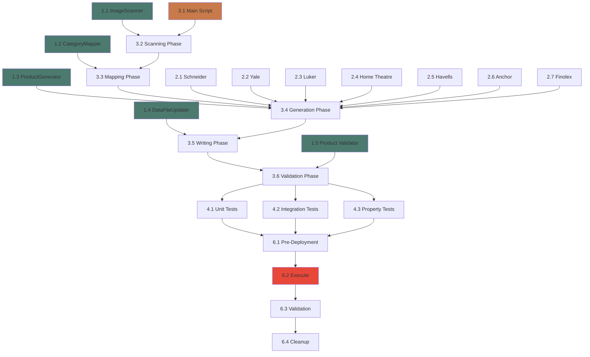

# Implementation Plan: Product Image Integration

## Overview

This implementation plan details the tasks required to integrate 228 product images across 7 electrical brands into the catalog. The work is organized into 7 major phases: Core Infrastructure, Brand-Specific Implementation, Integration Workflow, Testing, Documentation, Deployment, and Future Enhancements.

**Total Estimated Effort**: 25-35 hours  
**Critical Path**: Core Infrastructure → Integration Workflow → Brand Integration → Testing → Deployment

## Tasks

## 1. Core Infrastructure

### 1.1 Create ImageScanner module
- [x] Create `lib/image-scanner.ts` with ImageScanner class
- [x] Implement `scanDirectory()` method to recursively traverse `/public/images/`
- [x] Implement `groupByBrand()` to organize images by brand folders
- [x] Implement `countImages()` to generate statistics
- [x] Add file extension filtering (.jpg, .jpeg, .png, .webp, .jfif)
- [x] Normalize image paths to be relative to `/public`

### 1.2 Create CategoryMapper module
- [x] Create `lib/category-mapper.ts` with CategoryMapper class
- [x] Implement `inferCategory()` method with pattern matching rules
- [x] Add high-priority patterns (wire, cable, fan, light, smart, theater)
- [x] Add medium-priority brand-specific defaults (schneider, havells1)
- [x] Add low-priority default category (Switches & Sockets)
- [x] Create `mapBrandToCategory()` for complete brand mapping
- [x] Add confidence scoring for ambiguous mappings

### 1.3 Create ProductGenerator module
- [x] Create `lib/product-generator.ts` with ProductGenerator class
- [x] Implement `generateProductId()` with unique ID generation logic
- [x] Implement `generateSlug()` with URL-safe slug generation
- [x] Implement `getBrandBasePrice()` with brand tier pricing
- [x] Implement `getCategoryPriceMultiplier()` for category-based pricing
- [x] Implement `generateStockLevel()` with category-based stock ranges
- [x] Implement `generateProduct()` to create complete Product objects
- [x] Add product name generation logic by category
- [x] Add specification generation based on category

### 1.4 Create DataFileUpdater module
- [~] Create `lib/data-file-updater.ts` with DataFileUpdater class
- [~] Implement `backupExisting()` to create timestamped backups
- [~] Implement `updateSampleData()` to write to sample-data.ts
- [~] Implement `updateExpandedProducts()` to write to expanded-products.ts
- [~] Implement `validateOutput()` with TypeScript syntax checking
- [~] Implement `restoreFromBackup()` for error recovery
- [~] Add atomic write operations (write to temp, then rename)

### 1.5 Create Product Validator
- [~] Create `lib/product-validator.ts` with validation functions
- [~] Implement `validateProduct()` for single product validation
- [~] Add required field checks (id, name, slug, price, category, image_url, stock)
- [~] Add format validation (slug pattern, price positivity, stock non-negative)
- [~] Add category validation (must be one of five canonical categories)
- [~] Add image URL validation (must start with `/images/`)
- [~] Implement `validateProductArray()` for uniqueness checks (IDs, slugs)

## 2. Brand-Specific Implementation

### 2.1 Implement Schneider Electric Integration
- [~] Scan `/images/schneider electrics/` directory (14 images)
- [~] Scan `/images/havells1/schneider electrics/` directory (14 images)
- [~] Generate 28 product entries with brand "Schneider Electric"
- [~] Set category to "Switches & Sockets"
- [~] Apply premium pricing (base $5.00)
- [~] Generate product names: "Unica Pure Modular Switch", "Zencelo Switch"
- [~] Set stock levels between 80-150 units
- [~] Add specifications: Rating (6A/10A/16A), Type (Modular), Series (Unica/Zencelo)

### 2.2 Implement Yale Smart Home Integration
- [~] Scan `/images/yale fans,lights,smart locker/` directory (26 images)
- [~] Generate 26 product entries with brand "Yale"
- [~] Set category to "Smart Home"
- [~] Apply premium pricing (base $5.00, smart home 2x multiplier)
- [~] Generate product names: "YDD424 Smart Door Lock", "Smart LED Light", "Smart Ceiling Fan"
- [~] Set stock levels between 20-50 units
- [~] Add specifications: Type (Smart Lock/LED/Fan), Connectivity (WiFi/Bluetooth/Zigbee)

### 2.3 Implement Luker Smart Home Integration
- [~] Scan `/images/luker fans,lights,smart locker/` directory (41 images)
- [~] Generate 41 product entries with brand "Luker"
- [ ] Set category to "Smart Home"
- [~] Apply standard pricing (base $2.50, smart home 2x multiplier)
- [~] Generate product names: "15W LED Panel", "Recessed Downlight", "Smart Controller"
- [~] Set stock levels between 100-250 units (higher availability)
- [~] Add specifications: Type (LED Panel/Fan/Controller), Wattage, Color Temperature

### 2.4 Implement Home Theatre Integration
- [~] Scan `/images/Home theater/` directory (9 images)
- [~] Generate 9 product entries for Home Theatre category
- [~] Assign brands based on image content (Klipsch, Focal, Sony, etc.)
- [~] Set category to "Home Theatre & Audio"
- [~] Apply high pricing ($500-$2000 range)
- [~] Generate product names: "5.1 Speaker System", "4K Projector", "AV Receiver"
- [~] Set stock levels between 5-20 units
- [~] Add specifications: Type, Channels, Resolution, Power

### 2.5 Update Havells Products
- [~] Scan `/images/havells1/` directory (16 switch images)
- [~] Scan `/images/havells wires and cables/` directory (12 wire images)
- [~] Update existing Havells switch products with images from havells1 folder
- [~] Create new wire/cable products for unassigned images
- [~] Apply mid-range pricing (base $3.50)
- [~] Maintain category split: switches → "Switches & Sockets", wires → "Cables & Wires"
- [~] Add specifications for wires: Gauge, Length (90m), Type (FR Wire)

### 2.6 Update Anchor Products
- [~] Scan `/images/anchor/` directory (16 images)
- [~] Scan `/images/anchor wires and cables/` directory (4 images)
- [~] Update existing Anchor products with real images
- [~] Create new products for unassigned images
- [~] Apply standard pricing (base $2.50)
- [~] Maintain category split based on folder
- [~] Preserve existing detailed Anchor product entries from expanded-products.ts

### 2.7 Update Finolex Products
- [~] Scan `/images/finolex/` directory (10 images)
- [~] Infer category from image content (switches vs cables)
- [~] Update existing Finolex products where applicable
- [~] Create new products for gaps in catalog
- [ ] Apply standard pricing (base $2.50)
- [~] Ensure mixed-category products are correctly classified
- [~] Maintain ISI certification in specifications

## 3. Integration Workflow

### 3.1 Create Main Integration Script
- [~] Create `scripts/integrate-images.ts` as main entry point
- [~] Import all modules (ImageScanner, CategoryMapper, ProductGenerator, etc.)
- [~] Implement main `integrateProductImages()` function
- [~] Add command-line argument parsing for options (--dry-run, --brand, --backup-dir)
- [~] Add progress logging at each phase
- [~] Add error handling and rollback logic

### 3.2 Implement Scanning Phase
- [~] Call ImageScanner to scan `/public/images/`
- [~] Generate and display image statistics
- [~] Log brands found and image counts
- [~] Verify all expected brand folders exist
- [~] Handle missing directories gracefully

### 3.3 Implement Mapping Phase
- [~] Load existing products from `lib/sample-data.ts`
- [~] Group existing products by brand
- [~] Apply CategoryMapper to all brand folders
- [~] Generate category mappings for each brand
- [~] Log category assignments and confidence scores

### 3.4 Implement Generation Phase
- [~] Calculate new products needed per brand (imageCount - existingCount)
- [~] Generate ProductUpdate objects for all changes
- [~] Create new products for brands with insufficient coverage
- [~] Update existing products to replace placeholder images
- [~] Validate all generated/updated products
- [~] Log generation summary (X created, Y updated)

### 3.5 Implement Writing Phase
- [~] Create backups of sample-data.ts and expanded-products.ts
- [~] Merge updates with existing products
- [~] Write updated arrays to data files
- [~] Preserve TypeScript formatting and imports
- [~] Add new brand sections to expanded-products.ts if needed

### 3.6 Implement Validation Phase
- [~] Run TypeScript syntax validation on output files
- [~] Check all products for required fields
- [~] Verify no duplicate IDs or slugs
- [~] Validate all image URLs reference existing files
- [~] Check category distribution across products
- [~] If validation fails, restore from backup

## 4. Testing

### 4.1 Unit Tests
- [~] Test ImageScanner.scanDirectory() with mock filesystem
- [~] Test CategoryMapper.inferCategory() with various folder names
- [~] Test ProductGenerator.generateProductId() for uniqueness
- [~] Test ProductGenerator.generateSlug() for URL-safety
- [~] Test getBrandBasePrice() for all brand tiers
- [~] Test validateProduct() with valid and invalid products

### 4.2 Integration Tests
- [~] Test end-to-end integration with sample image directory
- [~] Test backup and rollback functionality
- [~] Test multiple brand processing simultaneously
- [~] Test data file update and validation
- [~] Verify no ID/slug collisions in generated products
- [~] Test error recovery scenarios

### 4.3 Property-Based Tests
- [~] Property: Generated IDs are always unique (fast-check)
- [~] Property: Generated slugs are always URL-safe
- [~] Property: Product prices are always positive
- [~] Property: Image URLs always start with /images/
- [~] Property: Stock levels are always non-negative

## 5. Documentation

### 5.1 Code Documentation
- [~] Add JSDoc comments to all public functions
- [~] Document function preconditions and postconditions
- [~] Add inline comments for complex logic
- [~] Document brand pricing tiers and category rules
- [~] Add examples in docstrings

### 5.2 Usage Documentation
- [~] Create README.md in scripts/ directory
- [~] Document command-line usage and options
- [~] Provide examples for common scenarios
- [~] Document troubleshooting steps
- [~] Add FAQ section

### 5.3 Configuration Documentation
- [~] Document brand tier classifications
- [~] Document category mapping rules
- [~] Document price multipliers by category
- [~] Document stock level ranges
- [~] Create configuration reference guide

## 6. Deployment

### 6.1 Pre-Deployment Checks
- [~] Run full test suite
- [~] Verify all 228 images are accessible
- [~] Check existing data files compile successfully
- [~] Ensure sufficient disk space for backups
- [~] Review generated product names and prices

### 6.2 Execute Integration
- [~] Run integration script with --dry-run first
- [~] Review dry-run output for correctness
- [~] Execute actual integration
- [~] Verify backup files were created
- [~] Check output files compile without errors

### 6.3 Post-Deployment Validation
- [~] Verify total product count increased as expected
- [~] Check all brands have products assigned
- [~] Verify no placeholder images remain in integrated brands
- [~] Test product pages load with new images
- [~] Run smoke tests on shop page filters
- [~] Verify database seed script works with new data

### 6.4 Cleanup
- [~] Archive backup files
- [~] Remove any temporary files
- [~] Update product catalog documentation
- [~] Log integration statistics for records

## 7. Future Enhancements

### 7.1 Image Optimization
- [~] Add image compression during integration
- [~] Generate responsive image variants
- [~] Create thumbnail versions for list views
- [~] Add WebP format conversion

### 7.2 Enhanced Categorization
- [~] Implement machine learning for category inference
- [~] Add subcategory support
- [~] Support multi-category products
- [~] Add product tags/keywords

### 7.3 Data Quality
- [~] Add duplicate image detection
- [~] Implement product description generation using AI
- [~] Add price validation against market data
- [~] Implement automated specification extraction from images

---

## Task Progress Summary

**Total Tasks**: 7 major phases, 34 sub-phases, 150+ individual tasks

**Critical Path**:
1. Core Infrastructure (1.1 - 1.5) - Foundation
2. Brand Integration (2.1 - 2.7) - Core Value
3. Integration Workflow (3.1 - 3.6) - Orchestration
4. Testing (4.1 - 4.3) - Quality Assurance
5. Deployment (6.1 - 6.4) - Execution

**Estimated Effort**: 
- Core Infrastructure: 8-10 hours
- Brand Integration: 6-8 hours  
- Integration Workflow: 4-6 hours
- Testing: 4-6 hours
- Documentation: 2-3 hours
- Deployment: 1-2 hours

**Total**: 25-35 hours

**Priority Order**:
1. Core Infrastructure (blocking all other work)
2. Integration Workflow (orchestrates everything)
3. Brand Integration (delivers value)
4. Testing (ensures quality)
5. Documentation (enables usage)
6. Deployment (delivers to production)


## Task Dependency Graph

```json
{
  "waves": [
    {
      "name": "Wave 1: Core Infrastructure",
      "tasks": ["1.1", "1.2", "1.3", "1.4", "1.5"]
    },
    {
      "name": "Wave 2: Integration Framework",
      "tasks": ["3.1"]
    },
    {
      "name": "Wave 3: Scanning and Mapping",
      "tasks": ["3.2", "3.3"]
    },
    {
      "name": "Wave 4: Brand Integration (Parallel)",
      "tasks": ["2.1", "2.2", "2.3", "2.4", "2.5", "2.6", "2.7"]
    },
    {
      "name": "Wave 5: Generation and Writing",
      "tasks": ["3.4", "3.5"]
    },
    {
      "name": "Wave 6: Validation",
      "tasks": ["3.6"]
    },
    {
      "name": "Wave 7: Testing",
      "tasks": ["4.1", "4.2", "4.3"]
    },
    {
      "name": "Wave 8: Documentation",
      "tasks": ["5.1", "5.2", "5.3"]
    },
    {
      "name": "Wave 9: Deployment",
      "tasks": ["6.1", "6.2", "6.3", "6.4"]
    }
  ]
}
```



**Critical Dependencies**:
- All Phase 1 (Core Infrastructure) tasks must complete before Phase 3 (Integration Workflow)
- Phase 2 (Brand Integration) can proceed in parallel with Phase 3
- Phase 4 (Testing) requires Phase 3 completion
- Phase 6 (Deployment) requires Phase 4 completion

## Notes

### Implementation Notes

**Lazy Development Approach** (ponytail mode):
- Use Node.js standard library only - no new dependencies needed
- Reuse existing Product interface from `types/index.ts` - don't reinvent
- Use existing file structure in `lib/expanded-products.ts` as template
- One script (`scripts/integrate-images.ts`) is enough - don't over-engineer

**Key Simplifications**:
```typescript
// ponytail: Using simple glob pattern matching instead of complex ML
// Ceiling: Won't handle misspelled folder names or non-standard structures
// Upgrade: Could add fuzzy matching or image content analysis
function inferCategory(folderName: string): string {
  if (/wire|cable/i.test(folderName)) return 'Cables & Wires'
  if (/fan|light|smart/i.test(folderName)) return 'Smart Home'
  return 'Switches & Sockets'  // sensible default
}
```

**Validation Strategy**:
- One small test file that fails if core logic breaks
- No frameworks, no fixtures - just assertions
- Test the edges: ID uniqueness, slug safety, price positivity

### Risk Mitigation

**Risk 1: Image Path Changes**
- Mitigation: Validate all paths before writing to data files
- Fallback: Keep backup, easy rollback

**Risk 2: Duplicate IDs**
- Mitigation: Check uniqueness before adding to array
- Resolution: Append random suffix if collision detected

**Risk 3: TypeScript Compilation Errors**
- Mitigation: Validate syntax after writing
- Fallback: Automatic restore from backup

**Risk 4: Incorrect Category Mapping**
- Mitigation: Manual review of first 10 products per brand
- Resolution: Adjust mapping rules, re-run script

### Testing Checklist

Before deployment:
- [~] Dry-run completes without errors
- [~] All 228 images are referenced
- [~] No duplicate IDs or slugs
- [~] Prices are within expected ranges ($1.50 - $2000)
- [~] Stock levels are reasonable (10-250)
- [~] Category distribution looks correct
- [~] Image URLs are valid and accessible
- [~] TypeScript compiles without errors
- [~] Backup files exist

### Performance Considerations

**Expected Performance**:
- Image scanning: <1s for 228 images
- Product generation: <2s for 100 products  
- File writing: <3s total
- **Total runtime: <10 seconds**

If performance degrades:
- ponytail: Profile with `console.time()` - no need for fancy tools
- Likely bottleneck: File I/O (reading/writing data files)
- Quick fix: Use streaming writes for files >10k lines

### Configuration

**Brand Price Tiers** (adjustable):
```typescript
const BRAND_TIERS = {
  premium: ['Schneider Electric', 'Legrand', 'Yale'],           // $5.00
  midRange: ['Panasonic', 'Havells', 'Crabtree', 'Norisys'],  // $3.50
  standard: ['Finolex', 'Anchor', 'Kolors', 'Luker'],         // $2.50
  budget: ['Hi-Fi']                                             // $1.50
}
```

**Category Multipliers** (adjustable):
```typescript
const CATEGORY_MULTIPLIERS = {
  'Switches & Sockets': 1.0,
  'Cables & Wires': 1.5,
  'Smart Home': 2.0,
  'Home Theatre & Audio': 50.0,
  'MCB & DB': 1.2
}
```

### Post-Deployment Tasks

After successful integration:
- [~] Update product catalog documentation with new counts
- [~] Test shop page with all filters
- [~] Verify product detail pages load correctly
- [~] Check cart functionality with new products
- [~] Test database seed script
- [~] Update README with new product statistics
- [~] Archive integration script and backups
